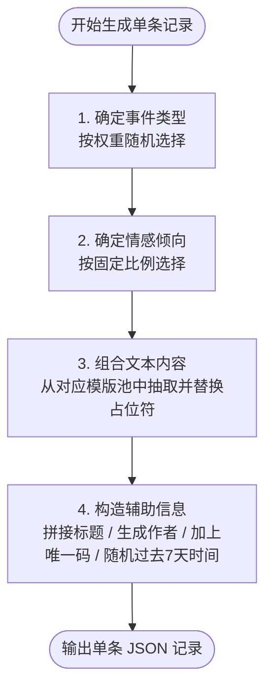

# 舆情测试数据生成方法报告

本报告详细说明了模拟舆情数据（Mock Data）的生成逻辑。系统通过概率组合不同的事件主题、情感极性、文案模板以及作者信息，动态合成出高度逼真、具备特定统计规律的测试数据集。

---

## 🔄 1. 测试数据生成流程

每一条舆情记录的生成均遵循以下流水线步骤：

---

## 🎲 2. 核心概率分配与具体字符串集

### 2.1 事件类型概率分配（第一步）

生成时首先根据设定的权重，随机抽取以下三个热点事件之一。每个事件包含其标题前缀、标题随机后缀和核心主体：

| 事件代码 (`code`) | 发生概率 | 标题前缀 | 可选标题后缀集 (`title_suffixes`) | 核心主体集 (`subjects`) |
| :--- | :--- | :--- | :--- | :--- |
| **goose** | **40%** | `【鹅腿风波】` | 1. 清北学生集体维权 2. 监管部门已介入 3. 阿姨回应争议 4. 鸭腿充当鹅腿引不满 5. 相关方致歉 | `鹅腿`、`网红烤鸭腿`、`陈阿姨` |
| **ev_fire** | **35%** | `【电车自燃】` | 1. 某品牌底盘磕碰起火 2. 官方紧急回应 3. 车主家属发声 4. 安全性遭质疑 5. 隐藏式门把手成隐患 | `那辆电车`、`某品牌新车`、`隐藏式门把手` |
| **milktea** | **25%** | `【奶茶过期】` | 1. 知名连锁店被曝篡改效期 2. 消费者疯狂吐槽 3. 门店停业整顿 4. 道歉声明发布 5. 记者暗访后厨 | `A牌奶茶`、`果茶底料`、`后厨` |

### 2.2 情感极性概率分配（第二步）

在选定事件后，根据特定的系统配比，随机决定该条舆情的情感极性（Sentiment）：
*   **负面 (Negative)**：**60%**
*   **中性 (Neutral)**：**30%**
*   **正面 (Positive)**：**10%**

情感极性的选择将直接决定后续抽取的**状态词**、**文本模板**以及**作者姓名池**。

---

## 📝 3. 文本模板与状态字符串的组合机制（第三步）

根据选定的 **事件类型** 和 **情感极性**，脚本会从对应的状态词池与文案模板池中进行二次随机抽取，然后将模板中的占位符 `[Subject]` 和 `[Sentiment_Status]` 进行替换。

### 3.1 鹅腿风波 (goose) 事件的文本组合

*   **负面 (概率 60%)**
    *   **状态词集**：`"以次充好"`、`"发霉发绿"`、`"其实是鸭腿"`
    *   **文案模板**：
        1. `以为吃的是[Subject]，今天爆出来是[Negative_Status]，当年排队买的大学生真是把心错付了！`
        2. `[Subject]居然[Negative_Status]，强烈要求退钱退赔！`
        3. `看到热搜气死了，一直在买的[Subject]竟然[Negative_Status]，简直是欺诈消费。`
*   **中性 (概率 30%)**
    *   **状态词集**：`"真假难辨"`、`"口感一般"`、`"价格偏贵"`
    *   **文案模板**：
        1. `吃瓜群众路过，感觉[Subject][Neutral_Status]，等官方的抽检通报吧。`
        2. `事情还没定论，先看看[Subject]到底是不是[Neutral_Status]，不盲目站队。`
*   **正面 (概率 10%)**
    *   **状态词集**：`"味道还可以"`、`"大家要求太高了"`、`"阿姨也不容易"`
    *   **文案模板**：
        1. `作为老顾客，我觉得[Subject][Positive_Status]，大家不要被网暴带节奏了。`
        2. `别听网上的瞎说，[Subject]明明[Positive_Status]，反正我还会继续支持！`

### 3.2 电车自燃 (ev_fire) 事件的文本组合

*   **负面 (概率 60%)**
    *   **状态词集**：`"烧成空壳了"`、`"门打不开"`、`"刹车失灵"`
    *   **文案模板**：
        1. `太可怕了，[Subject]撞击后居然[Negative_Status]，这品控谁还敢买？坚决避雷！`
        2. `生命安全第一，买个代步车[Subject]竟然[Negative_Status]，必须严查厂家！`
*   **中性 (概率 30%)**
    *   **状态词集**：`"起火原因未明"`、`"等待消防鉴定结果"`、`"属于小概率事件"`
    *   **文案模板**：
        1. `理性分析一波，[Subject]可能只是[Neutral_Status]，大家不要盲目恐慌制造焦虑。`
        2. `电车出事容易放大，先别急着下定论，[Subject]也有可能是[Neutral_Status]。`
*   **正面 (概率 10%)**
    *   **状态词集**：`"售后态度非常好"`、`"车身结构其实很坚固"`、`"系统预警很及时"`
    *   **文案模板**：
        1. `水军别黑了，事发时[Subject]表现不错，[Positive_Status]！不要为了黑而黑。`
        2. `作为老车主，证明[Subject]真的[Positive_Status]，不要信谣传谣自己吓自己。`

### 3.3 奶茶过期 (milktea) 事件的文本组合

*   **负面 (概率 60%)**
    *   **状态词集**：`"全是过期原料"`、`"偷偷换标签"`、`"喝出异物"`
    *   **文案模板**：
        1. `昨天刚喝了[Subject]，今天就看到[Negative_Status]的热搜，令人作呕，建议直接查封门店！`
        2. `太恶心了，经常点的[Subject]居然[Negative_Status]，再也不去了，避坑避坑！`
*   **中性 (概率 30%)**
    *   **状态词集**：`"员工操作不规范"`、`"只是偶发事件"`、`"门店管理有疏漏"`
    *   **文案模板**：
        1. `餐饮行业通病了，[Subject]可能[Neutral_Status]，等市监局的调查结果吧。`
        2. `客观来说，[Subject]出现[Neutral_Status]情况，希望能借此机会好好改善流程。`
*   **正面 (概率 10%)**
    *   **状态词集**：`"平时一直很干净"`、`"味道没变依然好喝"`、`"整改态度很积极"`
    *   **文案模板**：
        1. `我常去那家店，[Subject]其实[Positive_Status]，肯定是离职员工故意黑。`
        2. `出事后[Subject][Positive_Status]，还是愿意给个机会的，毕竟产品好喝。`

---

## 🛠️ 4. 辅助属性拼接与生成规则（第四步）

在文案内容拼接完成后，脚本会对其它元数据字段进行如下填充：

1.  **外部ID构造 (`external_id`)**：
    `{事件code}-{8位随机UUID}` (如：`goose-a1c2e3f4`)
2.  **标题构造 (`title`)**：
    `{事件前缀} + {随机标题后缀}` (如：`【电车自燃】 官方紧急回应`)
3.  **内容去重规避 (`content`)**：
    将替换完占位符的文本内容，在尾部强行追加防伪码：` (唯一码: {external_id})`，以规避后端的数据去重校验。
4.  **作者池与后缀 (`author`)**：
    根据情感分类从作者昵称池抽取，并附上随机数字后缀：`{昵称}_{100-9999之间的随机整数}`。
    *   **负面作者池**：`愤怒的消费者`、`维权斗士`、`看不下去的路人`、`正义之眼`、`被坑的苦主`、`打假先锋`
    *   **中性作者池**：`理中客`、`吃瓜一线`、`新闻观察员`、`路过看看`、`等官方通报`、`深夜吃瓜人`
    *   **正面作者池**：`铁粉编号1024`、`永远支持`、`不信谣不传谣`、`真实体验者`、`死忠粉`、`岁月静好`
5.  **发布时间 (`published_at`)**：
    在 `当前时间 - 7天（604800秒）` 的时间区间内随机生成一个时间戳，并格式化为 `YYYY-MM-DDTHH:MM:SS`。
